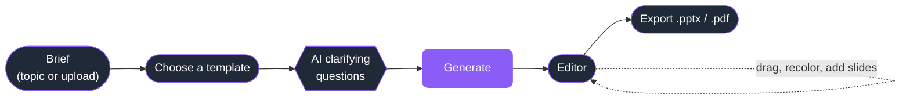

# EXdeck

AI presentation builder. Type a short brief, pick a template, and get a fully editable deck in seconds — real charts, themed layouts, speaker notes, and one-click export to PowerPoint and PDF.

🚀 **Try it now:** [exdeck.xyz](https://exdeck.xyz)

Drag and edit everything inline, ask the AI chat to rewrite a slide, switch the whole deck's template or content density on the fly, present full-screen, and share a live link. A 200,000-icon library, premium Canva/Gamma-grade designs, and real data charts built from your numbers.

## How it works

Describe the deck, choose a template, answer a couple of quick questions, and EXdeck writes and designs the whole thing. The template sets the look; the AI fills in the content. Everything after that is live editing — drag, recolor, ask the AI for a rewrite, switch themes, and export to PowerPoint or PDF in seconds.



Under the hood the browser stays thin. Long-running and key-sensitive work happens on Next.js API routes; everything else — drag, edit, recolor, template re-skin, PDF render — runs entirely client-side for speed and privacy.

```mermaid
flowchart TB
    subgraph Browser
      UI["Editor & landing UI"]
      PDF["jsPDF + html2canvas<br/>client-side PDF render"]
      AUTH["Firebase Auth client"]
    end

    subgraph "Next.js API routes"
      GEN["/api/generate"]
      CLAR["/api/clarify"]
      EDITS["/api/edit-slide"]
      EDITD["/api/edit-deck"]
      DENS["/api/redensify"]
      NOTES["/api/speaker-notes"]
      QA["/api/qa-prep"]
      TRANS["/api/translate"]
      EXPORT["/api/export"]
      ICON["/api/icon-search"]
      CLAIM["/api/claim-proplus"]
    end

    subgraph "External services"
      GROQ["Groq · llama-4-scout-17b-16e"]
      ICONIFY["Iconify · 200k+ icons"]
      FB_DB["Firebase Realtime DB"]
    end

    UI -->|"brief + template"| GEN
    UI -->|"clarifying Qs"| CLAR
    UI -->|"per-slide instruction"| EDITS
    UI -->|"deck-wide instruction"| EDITD
    UI -->|"new density"| DENS
    UI -->|"generate notes"| NOTES
    UI -->|"prep questions"| QA
    UI -->|"target language"| TRANS
    UI -->|"deck JSON"| EXPORT
    UI -->|"icon query"| ICON
    UI -->|"device + token"| CLAIM

    GEN --> GROQ
    CLAR --> GROQ
    EDITS --> GROQ
    EDITD --> GROQ
    DENS --> GROQ
    NOTES --> GROQ
    QA --> GROQ
    TRANS --> GROQ
    EDITS --> ICONIFY
    ICON --> ICONIFY
    EXPORT --> EXPORT_OUT(["pptxgenjs builds .pptx"])

    GEN -.->|"plan + usage gate"| FB_DB
    DENS -.->|"plan gate"| FB_DB
    CLAIM --> FB_DB

    UI -->|"deck JSON"| PDF
    PDF --> PDF_OUT(["Downloaded .pdf"])

    UI <-->|"sign in / plan / events"| AUTH
    AUTH --> FB_DB

    classDef ext fill:#0f172a,stroke:#94a3b8,color:#fff,rx:6
    classDef api fill:#8b5cf6,stroke:#8b5cf6,color:#fff,rx:6
    classDef br fill:#1f2937,stroke:#facc15,color:#fff,rx:6
    classDef out fill:#10b981,stroke:#10b981,color:#fff,rx:6
    class UI,PDF,AUTH br
    class GEN,CLAR,EDITS,EDITD,DENS,NOTES,QA,TRANS,EXPORT,ICON,CLAIM api
    class GROQ,ICONIFY,FB_DB ext
    class EXPORT_OUT,PDF_OUT out
```



Three patterns hold the system together:

1. **Single deck object** — the entire presentation lives in one typed `Deck` shape (`lib/types.ts`). Every page and every API route reads and writes it. No hidden state.
2. **Pure-function rendering** — `SlideCanvas` is the same component used in the editor, the thumbnail rail, present mode, and the off-screen PDF capture. One source of visual truth.
3. **Server is a thin proxy** — the API routes only do what the browser cannot: hold the Groq key, enforce plan limits, hit Iconify, and run pptxgenjs for the binary `.pptx`. Everything else is frontend.

## Showcase

**Start from a brief.** Describe the deck in a sentence (or paste/upload your own content), tune the audience, tone, slide count, and density.

<p align="center">
  
</p>

**Pick a template.** Choosing a template is the one required step — it sets the theme, font, background texture, and layout. The catalog leads with premium, Canva/Gamma-grade designs.

<p align="center">
  
</p>

**Edit everything live.** The full editor: inline text editing, drag-and-drop, AI chat, real data charts, speaker notes, present mode, and one-click export — plus premium switchers to change the density or template on the fly.

<p align="center">
  
</p>

The AI decides on its own whether a chart belongs and which type fits the data — a time trend becomes a line chart, a budget split becomes a pie, category comparisons become bars. If a topic has no numbers, no chart appears.

## Features

### Generation
- Brief → template → AI clarifying questions → deck, in about ten seconds
- Describe a topic **or** upload/paste your own content (PDF, .txt, .md — read on-device with OCR fallback)
- Nine slide layouts: title hero, bullets, table, **data chart**, two-column, quote, section, references, closing
- The model picks the layout per slide based on what the content actually is — no fixed template, so every deck reads differently
- **AI data charts** — bar, line, area, pie, and donut, built from the topic's real figures, theme-colored, resizable, and exported as vectors to both PPTX and PDF

### Design
- Premium **Canva/Gamma-grade templates** with hand-built low-opacity textured backgrounds
- The **Concept** style — colorful numbered cards and a bold left-aligned hero — applied by default to every deck
- 45 themes, 28 Google fonts, and 27 recolorable background graphics
- Per-slide style variants you can switch on any slide (title, bullets, two-column, table, quote, section, closing)
- 200,000 searchable icons (Iconify) plus in-house decorations

### Editing
- Per-slide AI chat that knows the deck topic, theme, every slide title, and existing graphics
- Deck-wide AI editing ("add three competitor slides", "tighten every bullet")
- Drag-and-drop text boxes, inline editing, click-to-recolor graphics, image upload
- Slide reorder, duplicate, insert-between, and delete from the thumbnail rail
- Undo, autosave to your account, and a guided one-time onboarding tour

### Present & finish
- AI **speaker notes** with a teleprompter and split-by-speaker mode
- **Q&A prep** — likely audience questions with suggested answers, plus ask-your-own
- One-click **deck translation** into any language (layout preserved)
- Full-screen **Present** mode with PowerPoint-style shortcuts
- Real `.pptx` and `.pdf` export that pixel-mirrors the on-screen design, plus a **notes handout** PDF
- Public **share links** with view analytics

### Plans & premium
- **Free / Pro ($1.99/mo)** tiers, plus Team and Organisation plans for shared seats, enforced both client-side (for UX) and server-side (non-bypassable)
- Free: 3 decks/month, watermark on exports, finishing features locked
- Pro: 10 decks/month, speaker notes, Q&A prep, icons, reorder, handout, **change density**, **switch template**
- Pro Plus: unlimited decks, everything in Pro, plus **translation**
- Editor-side premium switchers: rewrite the whole deck at a new **content density**, or re-skin it with a different **template**, in one click

## Stack

- Next.js 14 with the App Router
- TypeScript and Tailwind
- Groq SDK (model `meta-llama/llama-4-scout-17b-16e-instruct`) with multi-key fallback
- Iconify for icon search
- pptxgenjs for PowerPoint export
- jsPDF and html2canvas for PDF export
- Firebase Auth and Realtime Database (auth, plans, usage, share analytics)
- Lucide for UI icons

## Setup

```bash
git clone https://github.com/izhan0102/exdeck.git
cd exdeck
npm install
cp .env.local.example .env.local
# fill in the values, then
npm run dev
```

Open http://localhost:3000.

### Required env vars

```
GROQ_API_KEY=your_groq_key
GROQ_API_KEY_FALLBACK=optional_second_key

NEXT_PUBLIC_FIREBASE_API_KEY=...
NEXT_PUBLIC_FIREBASE_AUTH_DOMAIN=...
NEXT_PUBLIC_FIREBASE_PROJECT_ID=...
NEXT_PUBLIC_FIREBASE_STORAGE_BUCKET=...
NEXT_PUBLIC_FIREBASE_MESSAGING_SENDER_ID=...
NEXT_PUBLIC_FIREBASE_APP_ID=...
NEXT_PUBLIC_FIREBASE_DATABASE_URL=...

# server-only: base64 service-account JSON for plan/usage enforcement
FIREBASE_SERVICE_ACCOUNT_KEY=...
```

The Groq and service-account keys are server-only. The Firebase `NEXT_PUBLIC_*` values are client-side and public by Google's design, protected by Auth authorized domains and Realtime Database security rules.

## Routes

- `/` — landing page with feature tour and live counters
- `/auth` — sign in / sign up (email and Google)
- `/app` — the generator and editor (requires sign-in)
- `/redeem` — contributor promo: one-time Pro Plus pass
- `/blog`, `/[keyword]` — SEO content hub and keyword landing pages
- `/privacy`, `/terms`, `/refund`, `/shipping`, `/contact` — legal pages

## API Routes

The application uses a small set of API routes for work that cannot safely or efficiently run in the browser. Every AI route is authenticated, rate-limited, and (where relevant) plan-gated.

| Route | Purpose | External |
| --- | --- | --- |
| `/api/generate` | Build a full `Deck` from a brief + template (deck-limit + usage enforced) | Groq |
| `/api/clarify` | Generate the pre-generation clarifying questions | Groq |
| `/api/edit-slide` | AI patch to a single slide | Groq, Iconify |
| `/api/edit-deck` | AI edits across the whole deck (add/remove/reorder/patch) | Groq |
| `/api/redensify` | Rewrite the deck at a new content density (Pro) | Groq |
| `/api/speaker-notes` | Generate spoken speaker notes per slide (Pro) | Groq |
| `/api/qa-prep` | Likely audience questions + suggested answers (Pro) | Groq |
| `/api/translate` | Translate the whole deck in place (Pro Plus) | Groq |
| `/api/export` | Build the downloadable `.pptx` | pptxgenjs |
| `/api/icon-search` | Proxy to Iconify icon search | Iconify |
| `/api/claim-proplus` | Grant a one-time, per-device Pro Plus promo pass | Firebase Admin |

## Project structure

```
app/
  page.tsx              landing
  app/page.tsx          generator and editor
  auth/page.tsx         login / signup
  redeem/page.tsx       contributor Pro Plus promo
  api/                  generate, clarify, edit-slide, edit-deck,
                        redensify, speaker-notes, qa-prep, translate,
                        export, icon-search, claim-proplus
components/             SlideCanvas, DeckPreview, Presenter, TemplateGallery,
                        DeckTour, GenerateOverlay, StyleVariants, etc.
lib/
  types.ts              the single Deck/Slide shape
  groq.ts               generation, edit, notes, translate, density prompts
  groqClient.ts         multi-key Groq client with fallback
  templates.ts          template catalog (theme + font + graphic + variants)
  themes.ts             theme palette catalog
  graphics.ts           background graphic catalog (textured, low-opacity)
  fonts.ts              Google font presets
  plans.ts              plan tiers, features, limits (single source of truth)
  plan.ts / planServer.ts   client + server plan resolution (with expiry)
  usage.ts              monthly generation metering
  pdfExport.ts          client-side PDF builder
  firebase.ts / firebaseAdmin.ts   client + admin Firebase
  auth.ts               sign-in helpers
```

## Notes

- Built by **Muhammad Izhan** — Computer Science undergraduate at RNS Institute of Technology, Bengaluru.
- LinkedIn: https://www.linkedin.com/in/muhammad-izhan-a404752a6/
- GitHub: https://github.com/izhan0102

## License

All rights reserved. The code is published for transparency and portfolio purposes; please do not redistribute or build a competing product without permission.
